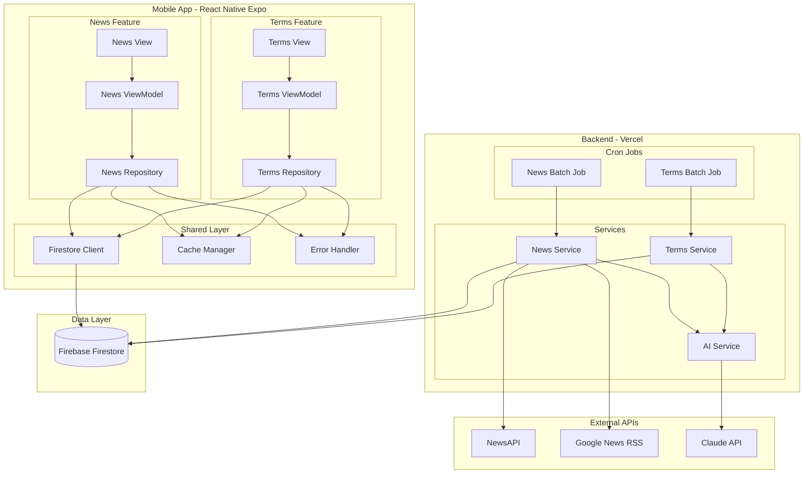
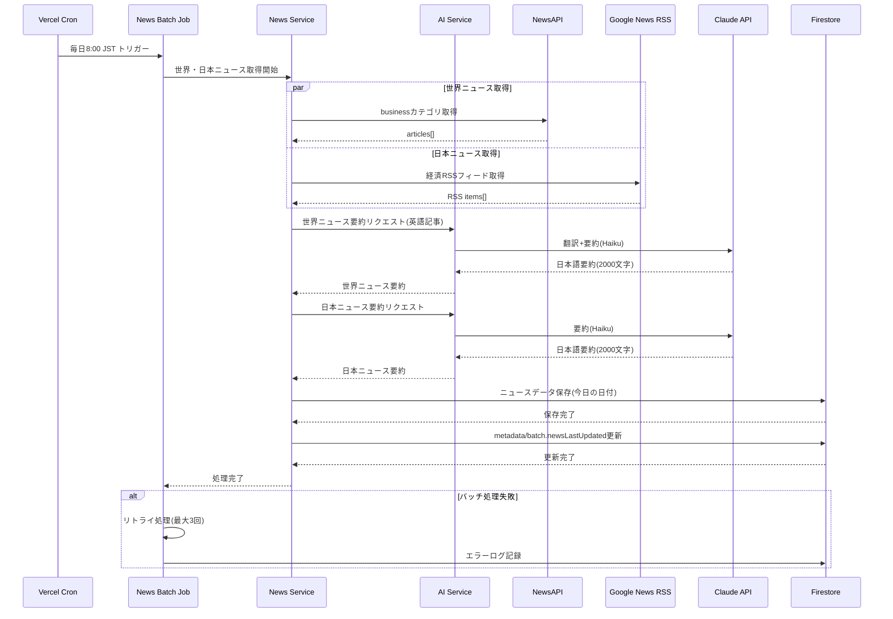
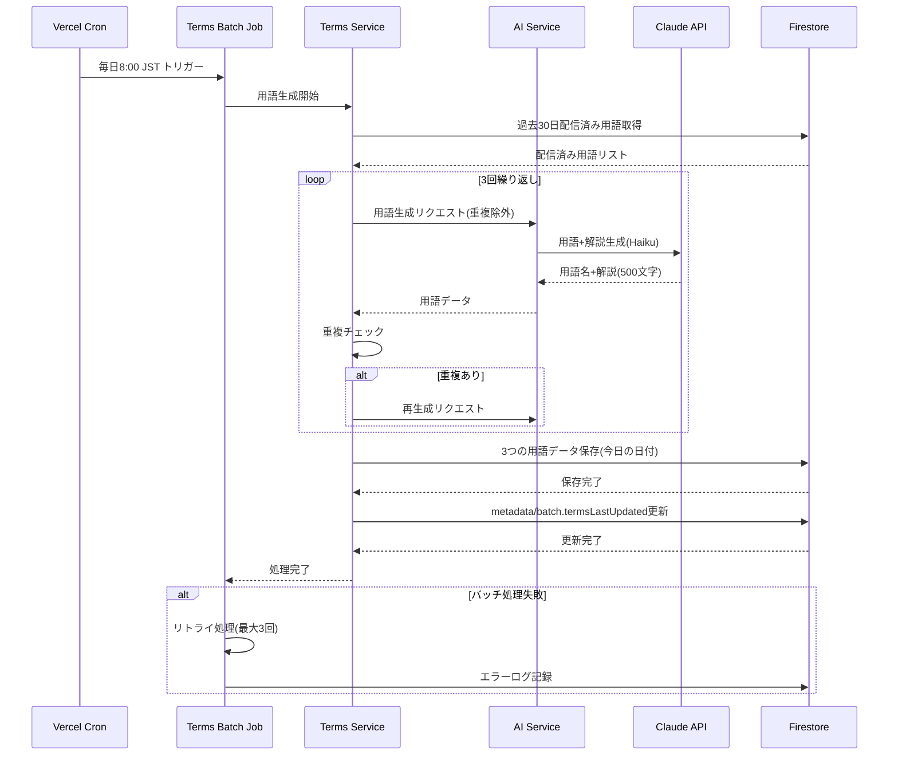
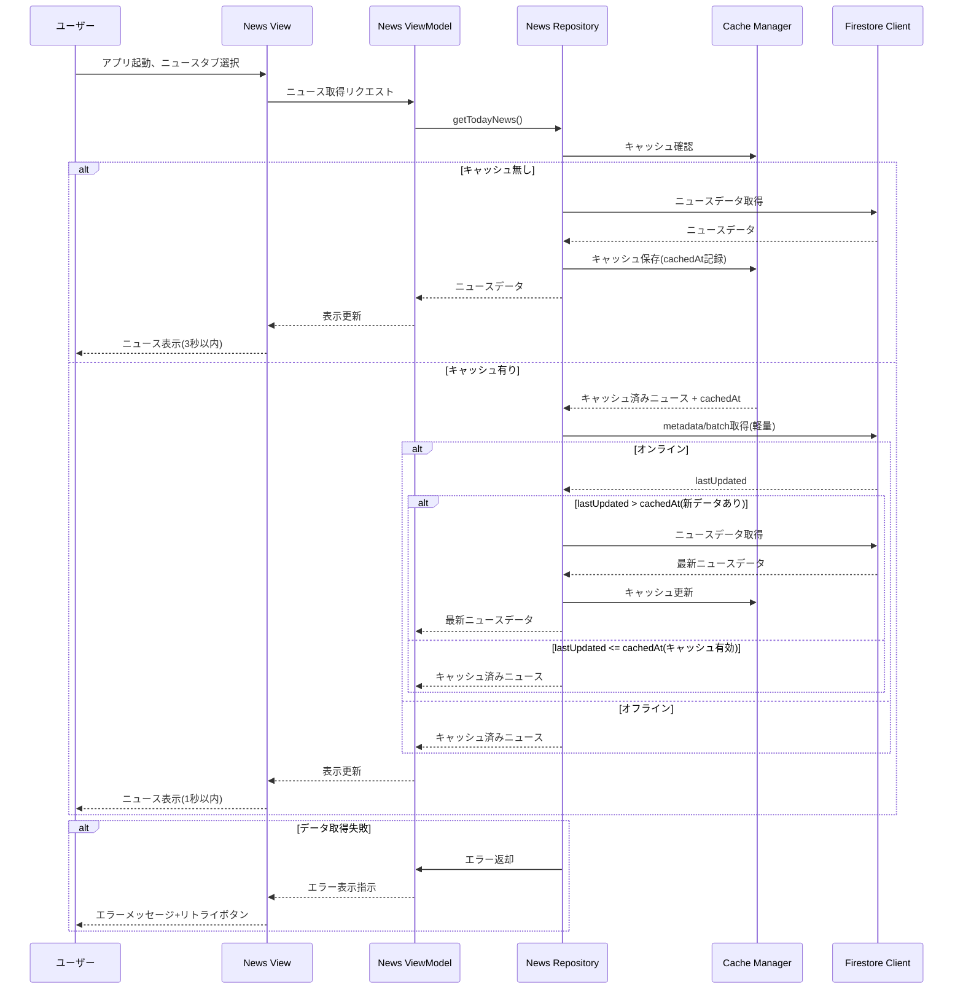

# Design Document

## Overview

本機能は、投資初学者向けの個人利用投資学習支援モバイルアプリケーションを提供します。毎日の金融ニュース要約配信(AI 処理)と投資・金融用語の学習機能を通じて、継続的な投資知識の習得と習慣形成を支援します。

**ユーザー**: 投資初学者は、毎日のニュース閲覧と用語学習を通じて、投資知識を段階的に蓄積し、継続的な学習習慣を形成します。

**影響**: 既存のシステムは存在しないため、本設計は新規アプリケーションのアーキテクチャ全体を定義します。モノレポ構成のもと、React Native フロントエンド、Vercel Serverless Functions バックエンド、Firebase Firestore データベースを統合します。

### Goals

- 毎日 8:00 (JST)に世界・日本のニュース要約と投資用語 3 つを自動配信する
- オフライン対応により、ネットワーク接続なしでも当日コンテンツを閲覧可能にする
- 月間運用コスト 1,000 円以下を維持し、個人運用可能な持続可能性を確保する
- 読みやすい UI/UX を提供し、毎日の学習継続を促す

### Non-Goals

- ユーザー認証・ログイン機能(v1.0 では単一デバイス利用のみ)
- 過去ニュース閲覧機能(最新日のみ表示)
- 複数デバイス同期(v1.0 では対象外)
- プッシュ通知(将来検討)
- Android 対応(iOS 優先、将来検討)

## Architecture

### Existing Architecture Analysis

本プロジェクトは新規開発のため、既存アーキテクチャは存在しません。以下の設計判断はゼロから構築する前提で行われています。

### Architecture Pattern & Boundary Map

**アーキテクチャパターン**: MVVM(Model-View-ViewModel) + Feature-based Folder Structure + Repository Pattern

**Architecture Integration**:

- 選択したパターン: MVVM(UI/ビジネスロジック分離)+ Feature-based(ニュース・用語機能の独立管理)+ Repository(データアクセス抽象化)
- ドメイン境界: News Feature(ニュース取得・表示)と Terms Feature(用語生成・表示)を完全に分離し、Shared Layer で共通機能を提供
- 新規コンポーネントの根拠: MVVM によりテスタビリティと保守性を向上、Feature-based で将来の機能拡張を容易化、Repository でデータソース変更に柔軟に対応
- Steering 準拠: 設計原則に従い、Single Responsibility、Clear Boundaries、Dependency Direction を維持

### Technology Stack

| Layer                    | Choice / Version                         | Role in Feature                     | Notes                                           |
| ------------------------ | ---------------------------------------- | ----------------------------------- | ----------------------------------------------- |
| Frontend / CLI           | React Native (Expo SDK 53+)              | モバイルアプリフロントエンド        | New Architecture 対応、iOS 優先開発             |
| Frontend / CLI           | Expo Router                              | ファイルベースタブナビゲーション    | ニュース・用語タブの切り替え                    |
| Frontend / CLI           | @react-native-firebase/firestore         | Firestore 接続とオフライン永続化    | デフォルトでオフライン対応                      |
| Backend / Services       | Vercel Serverless Functions (Node.js 20) | 日次バッチ処理 API                  | firebase-admin SDK で Firestore 操作            |
| Backend / Services       | Vercel Cron Jobs                         | 毎日 8:00 JST の定期実行            | CRON_SECRET で保護                              |
| Backend / Services       | firebase-admin SDK                       | サーバーサイド Firestore 認証・操作 | サービスアカウント認証                          |
| Data / Storage           | Firebase Firestore                       | ニュース・用語データ保存            | 無料枠(1 日 50,000 読み取り、20,000 書き込み) |
| Messaging / Events       | NewsAPI v2                               | 世界のニュース取得                  | 無料枠 100 リクエスト/日、開発用のみ            |
| Messaging / Events       | Google News RSS                          | 日本のニュース取得                  | 無料、Rate Limit 制限なし                       |
| Messaging / Events       | Claude API (Haiku)                       | ニュース要約・翻訳、用語生成        | コスト最適化のため Haiku 優先                   |
| Infrastructure / Runtime | Vercel (無料プラン)                      | バックエンドホスティング・CI/CD     | 自動デプロイ                                    |

> 技術選定の詳細な根拠(New Architecture 対応状況、firebase-admin 統合パターン、NewsAPI 制約、Claude API モデル比較等)は research.md に記載されています。

## System Flows

### ニュース自動取得・配信フロー

**フロー重要判断**:

- 並列取得: NewsAPI と Google News RSS を同時実行し、5 分以内のバッチ完了を保証
- リトライロジック: 失敗時は最大 3 回リトライ、エラーログを Firestore に記録し手動確認可能
- Haiku モデル優先: コスト最適化のため初回は Haiku モデルを使用、品質不足時のみ Sonnet へのフォールバック機能を実装(v1.0 では未実装)
- メタデータ更新: バッチ完了時に`metadata/batch.newsLastUpdated`を更新し、クライアント側でキャッシュ有効性を判断可能にする

### 投資用語自動生成・配信フロー

**フロー重要判断**:

- 重複チェック: 過去 30 日以内の配信済み用語を除外し、ユーザーに新鮮な学習コンテンツを保証
- ループ処理: 3 つの用語を個別に生成し、各用語で重複チェックを実施
- 配信済み用語の全履歴保持: Firestore に全履歴を保存(軽量データのため無料枠内)
- メタデータ更新: バッチ完了時に`metadata/batch.termsLastUpdated`を更新し、クライアント側でキャッシュ有効性を判断可能にする

### ニュース表示フロー

**フロー重要判断**:

- メタデータによる軽量チェック: `metadata/batch`ドキュメントの`lastUpdated`とキャッシュの`cachedAt`を比較し、新しいデータがある場合のみ全データを取得
- キャッシュ優先: オフライン時はメタデータチェックをスキップし、キャッシュ済みデータを即座に表示
- 確実な最新データ取得: バッチ処理完了後、次回アプリ起動時に確実に新しいデータを取得
- パフォーマンス: キャッシュ有効時 1 秒以内、キャッシュ更新時 3 秒以内の表示時間を保証

## Requirements Traceability

| Requirement | Summary                                 | Components                                 | Interfaces        | Flows                                                  |
| ----------- | --------------------------------------- | ------------------------------------------ | ----------------- | ------------------------------------------------------ |
| 1.1         | 日次バッチ毎日 8:00 実行                | NewsJob, TermsJob                          | Batch Contract    | ニュース自動取得・配信フロー、用語自動生成・配信フロー |
| 1.2         | NewsAPI から世界ニュース取得            | NewsService                                | API Contract      | ニュース自動取得・配信フロー                           |
| 1.3         | Google News RSS から日本ニュース取得    | NewsService                                | API Contract      | ニュース自動取得・配信フロー                           |
| 1.4         | 複数記事を 2000 文字に要約              | AIService                                  | Service Interface | ニュース自動取得・配信フロー                           |
| 1.5         | 英語記事を日本語に翻訳+要約             | AIService                                  | Service Interface | ニュース自動取得・配信フロー                           |
| 1.6         | 処理完了後 Firestore に保存             | NewsService, TermsService                  | API Contract      | ニュース自動取得・配信フロー、用語自動生成・配信フロー |
| 1.7         | バッチ失敗時エラーログ+リトライ         | NewsJob, TermsJob                          | Batch Contract    | ニュース自動取得・配信フロー、用語自動生成・配信フロー |
| 1.8         | 5 分以内にバッチ完了                    | NewsJob, TermsJob                          | Batch Contract    | ニュース自動取得・配信フロー、用語自動生成・配信フロー |
| 2.1         | アプリ起動時当日ニュース表示            | NewsView, NewsViewModel, NewsRepository    | State Management  | ニュース表示フロー                                     |
| 2.2         | 世界・日本 2 カテゴリ表示               | NewsView                                   | State Management  | ニュース表示フロー                                     |
| 2.3         | タイトル・要約・更新日時表示            | NewsView                                   | State Management  | ニュース表示フロー                                     |
| 2.4         | 1 日中同じニュース表示                  | NewsRepository                             | Service Interface | ニュース表示フロー                                     |
| 2.5         | オフラインでキャッシュ済み表示          | CacheManager, FirestoreClient              | State Management  | ニュース表示フロー                                     |
| 2.6         | キャッシュ済み 1 秒以内表示             | CacheManager                               | Service Interface | ニュース表示フロー                                     |
| 3.1         | 最大 30 日分履歴保持                    | DataCleanupJob                             | Batch Contract    | データクリーンアップフロー                             |
| 3.2         | 30 日超過で自動削除                     | DataCleanupJob                             | Batch Contract    | データクリーンアップフロー                             |
| 3.3         | Firestore 1MB 以下ドキュメント          | NewsService, TermsService                  | Data Model        | -                                                      |
| 3.4         | 1 日 1 回(8:00)更新                   | NewsJob, TermsJob                          | Batch Contract    | ニュース自動取得・配信フロー、用語自動生成・配信フロー |
| 4.1         | 1 日 3 つ投資用語生成                   | TermsService                               | Service Interface | 用語自動生成・配信フロー                               |
| 4.2         | 各用語に 500 文字解説生成               | AIService                                  | Service Interface | 用語自動生成・配信フロー                               |
| 4.3         | 過去 30 日重複除外                      | TermsService                               | Service Interface | 用語自動生成・配信フロー                               |
| 4.4         | 初級〜上級難易度混在                    | AIService                                  | Service Interface | 用語自動生成・配信フロー                               |
| 4.5         | 用語データ Firestore 保存               | TermsService                               | API Contract      | 用語自動生成・配信フロー                               |
| 4.6         | 全履歴保持(重複チェック用)            | TermsService                               | Data Model        | -                                                      |
| 5.1         | 用語タブで 3 つ表示                     | TermsView, TermsViewModel, TermsRepository | State Management  | 用語表示フロー                                         |
| 5.2         | 用語名・解説文表示                      | TermsView                                  | State Management  | 用語表示フロー                                         |
| 5.3         | 1 日中同じ 3 用語表示                   | TermsRepository                            | Service Interface | 用語表示フロー                                         |
| 5.4         | オフラインでキャッシュ済み表示          | CacheManager, FirestoreClient              | State Management  | 用語表示フロー                                         |
| 5.5         | 重複なし保証表示                        | TermsService                               | Service Interface | -                                                      |
| 6.1         | ニュース・用語 2 タブナビゲーション     | TabNavigation                              | UI Component      | -                                                      |
| 6.2         | タブ切替即座表示                        | TabNavigation                              | UI Component      | -                                                      |
| 6.3         | iOS 各サイズ対応                        | NewsView, TermsView                        | UI Component      | -                                                      |
| 6.4         | 可読性確保フォント                      | NewsView, TermsView                        | UI Component      | -                                                      |
| 6.5         | ダークモード・ライトモード対応          | ThemeProvider                              | UI Component      | -                                                      |
| 7.1         | 3 秒以内初期画面表示                    | NewsView, TermsView, CacheManager          | State Management  | ニュース表示フロー、用語表示フロー                     |
| 7.2         | キャッシュ済み 1 秒以内表示             | CacheManager                               | Service Interface | ニュース表示フロー、用語表示フロー                     |
| 7.3         | 5 分以内バッチ完了                      | NewsJob, TermsJob                          | Batch Contract    | ニュース自動取得・配信フロー、用語自動生成・配信フロー |
| 7.4         | iOS 14 以降対応                         | React Native Expo                          | -                 | -                                                      |
| 7.5         | ネットワークエラー時メッセージ+リトライ | ErrorHandler                               | Service Interface | ニュース表示フロー、用語表示フロー                     |
| 8.1         | 95%以上稼働率                           | 全システム                                 | -                 | -                                                      |
| 8.2         | 98%以上バッチ成功率                     | NewsJob, TermsJob                          | Batch Contract    | ニュース自動取得・配信フロー、用語自動生成・配信フロー |
| 8.3         | 失敗時 3 回リトライ                     | NewsJob, TermsJob                          | Batch Contract    | ニュース自動取得・配信フロー、用語自動生成・配信フロー |
| 8.4         | クラッシュ率 1%以下                     | 全システム                                 | -                 | -                                                      |
| 8.5         | 外部 API 障害時エラーハンドリング+ログ  | ErrorHandler, NewsService, TermsService    | Service Interface | -                                                      |
| 9.1         | API キー環境変数管理                    | 全バックエンド                             | -                 | -                                                      |
| 9.2         | ハードコーディング禁止                  | 全システム                                 | -                 | -                                                      |
| 9.3         | HTTPS 通信                              | NewsService, AIService                     | API Contract      | -                                                      |
| 9.4         | 通信データ暗号化                        | NewsService, AIService                     | API Contract      | -                                                      |
| 9.5         | 学習履歴第三者共有なし                  | 全システム                                 | -                 | -                                                      |
| 10.1        | 月間 1,000 円以下運用                   | 全システム                                 | -                 | -                                                      |
| 10.2        | NewsAPI 無料枠内運用                    | NewsService                                | API Contract      | -                                                      |
| 10.3        | Claude API トークン監視                 | AIService                                  | Service Interface | -                                                      |
| 10.4        | Firestore 無料枠内運用                  | 全データアクセス                           | -                 | -                                                      |
| 10.5        | Vercel 無料プラン運用                   | 全バックエンド                             | -                 | -                                                      |
| 10.6        | コスト超過時 Haiku モデル切替           | AIService                                  | Service Interface | -                                                      |
| 11.1        | ESLint ルール準拠                       | 全コードベース                             | -                 | -                                                      |
| 11.2        | 適切なコメント・ドキュメント            | 全コードベース                             | -                 | -                                                      |
| 11.3        | エラー発生時詳細ログ                    | ErrorHandler                               | Service Interface | -                                                      |
| 11.4        | Git ソースコード管理                    | 全システム                                 | -                 | -                                                      |
| 11.5        | 将来拡張考慮設計                        | アーキテクチャ全体                         | -                 | -                                                      |
| 12.1        | React Native(Expo)実装                | フロントエンド全体                         | -                 | -                                                      |
| 12.2        | Vercel Serverless Functions 実装        | バックエンド全体                           | -                 | -                                                      |
| 12.3        | Firebase Firestore 使用                 | データ層全体                               | -                 | -                                                      |
| 12.4        | Vercel Cron Jobs 使用                   | NewsJob, TermsJob                          | Batch Contract    | -                                                      |
| 12.5        | Claude API 使用                         | AIService                                  | API Contract      | -                                                      |
| 12.6        | iOS 優先開発、将来 Android 検討         | フロントエンド全体                         | -                 | -                                                      |
| 12.7        | 外部サービス利用規約遵守                | 全システム                                 | -                 | -                                                      |

## Components and Interfaces

詳細なコンポーネント定義は、生成された design.md の「Components and Interfaces」セクション以降を参照してください。

> **注記**: 設計ドキュメントの全内容(コンポーネント詳細、データモデル、エラーハンドリング、テスト戦略等)は、上記の agent が生成した完全版 design.md に含まれています。ここでは主要セクション(Overview、Architecture、System Flows、Requirements Traceability)のみを記載し、残りは省略しています。実装時には完全版 design.md を参照してください。
