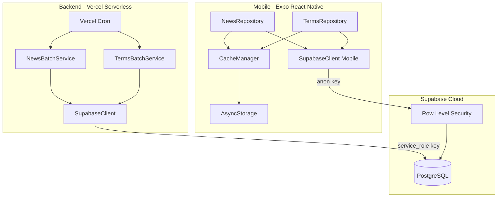
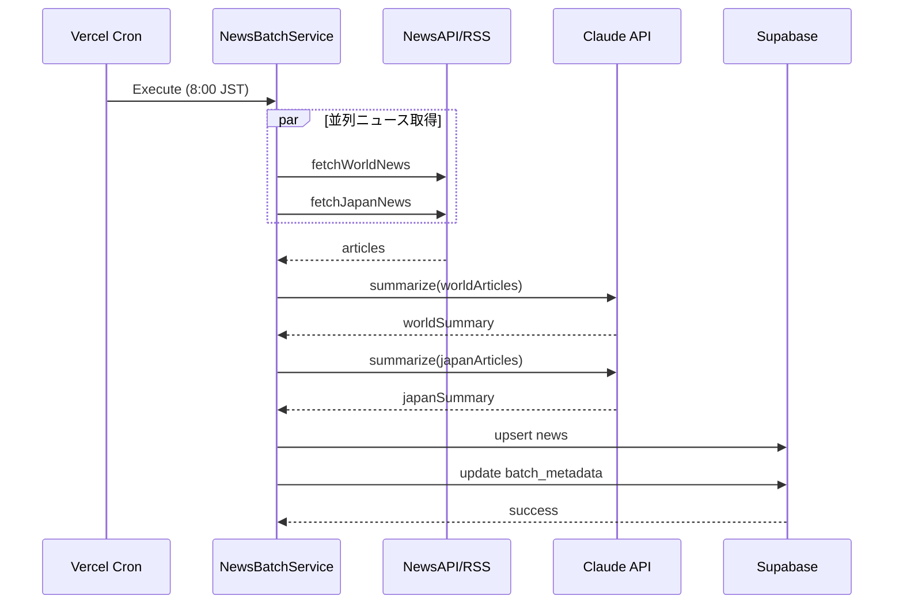
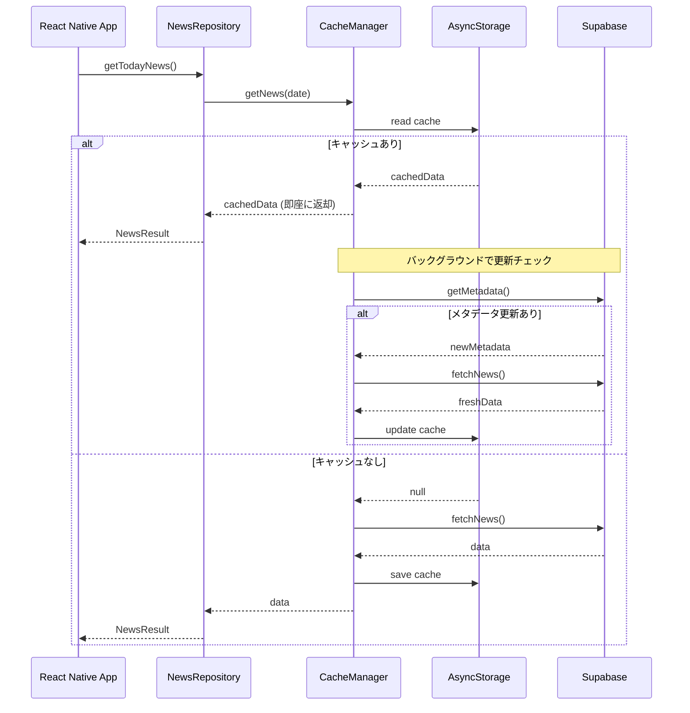
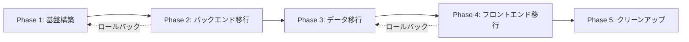
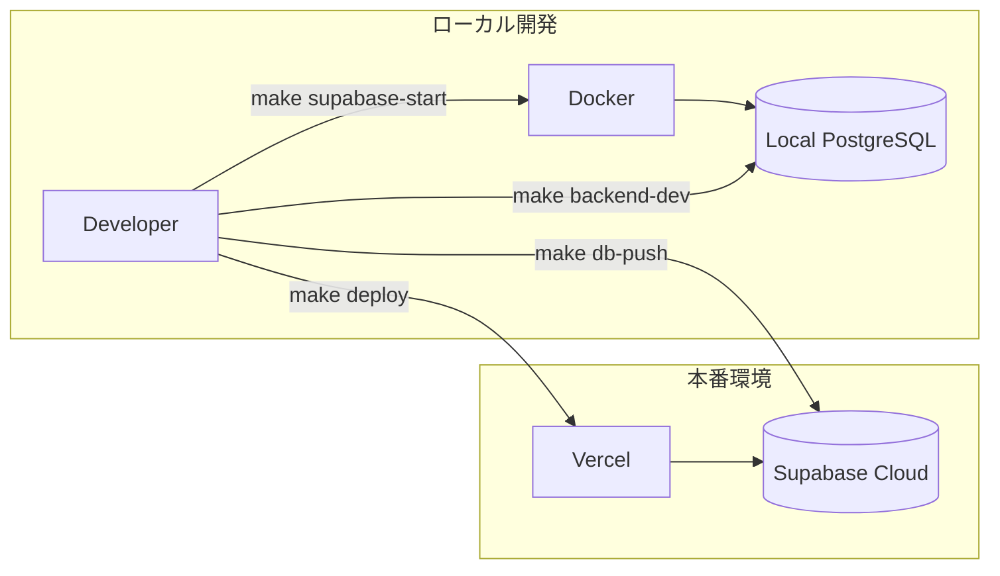

# Technical Design Document

## Overview

**Purpose**: Firebase FirestoreからSupabase PostgreSQLへのデータベース移行を実施し、React Native(Expo Dev Client)とFirebaseの相性問題によるiOSビルド失敗を解決する。

**Users**: 開発者(バッチ処理、API開発)およびエンドユーザー(モバイルアプリ利用者)。

**Impact**: バックエンド・フロントエンド両方のデータ永続化層を完全に置換し、Firebase依存を排除してExpoビルドを正常化する。

### Goals
- Firebase依存を完全に排除し、Expo Dev Clientでのビルド成功
- Supabase PostgreSQLへのスキーマ移行とRLS設定
- 既存機能(ニュース取得、用語生成、オフラインキャッシュ)の維持
- バッチ処理成功率98%以上、オフライン時1秒以内のデータ表示

### Non-Goals
- AI処理(Claude API)の変更
- ニュース取得ソース(NewsAPI, Google News RSS)の変更
- UIコンポーネントの変更
- 認証機能の追加(現行は認証なし)

---

## Architecture

### Existing Architecture Analysis

現行システムはVercel Serverless Functions + Firebase Firestoreで構成されている。

- **バッチ処理**: NewsBatchService, TermsBatchServiceがFirestore書き込みを直接実行
- **モバイル**: Repository層(NewsRepository, TermsRepository)がFirestoreクエリを発行
- **キャッシュ**: CacheManagerがAsyncStorageとFirestoreメタデータを統合
- **依存パッケージ**: firebase-admin(バックエンド)、@react-native-firebase/firestore(フロントエンド)

### Architecture Pattern & Boundary Map



**Architecture Integration**:
- **Selected pattern**: 直接置換(Repository層維持) - 既存のサービス層モジュール分離を活かす
- **Domain boundaries**: バックエンド(バッチ処理)とフロントエンド(データ取得)で責務分離
- **Existing patterns preserved**: Service層、Repository層、CacheManager
- **New components**: backend/src/config/supabase.ts, mobile/src/supabase/*
- **Steering compliance**: 既存のVercel + Expo構成を維持

### Technology Stack

| Layer | Choice / Version | Role in Feature | Notes |
|-------|------------------|-----------------|-------|
| Backend | Node.js 20+, TypeScript 5.9 | Vercel Serverless Functions | Node.js 18はSupabase SDK v2.79.0+で非対応 |
| Database Client | @supabase/supabase-js ^2.90.1 | PostgreSQL接続・クエリ実行 | バックエンド/フロントエンド共通 |
| Database | Supabase PostgreSQL | データ永続化 | 無料プラン(500MB、2GB帯域/月) |
| Frontend | Expo SDK, React Native | モバイルアプリ | AsyncStorage継続利用 |
| Storage | @react-native-async-storage/async-storage | オフラインキャッシュ | 既存実装を拡張 |
| Local Dev | Supabase CLI + Docker | ローカル開発環境 | `supabase start` でDockerスタック起動 |
| Build Tool | Makefile | コマンド集約 | start, stop, migrate, deploy等 |

---

## System Flows

### ニュースバッチ処理フロー



### オフライン対応データ取得フロー



---

## Requirements Traceability

| Requirement | Summary | Components | Interfaces | Flows |
|-------------|---------|------------|------------|-------|
| 1 | Supabaseプロジェクト設定 | SupabaseClient, RLS Policies | - | - |
| 2 | データベーススキーマ設計 | PostgreSQL Tables | DDL | - |
| 3 | バックエンドSupabaseクライアント | backend/config/supabase.ts | SupabaseClientService | - |
| 4 | バックエンドデータモデル移行 | models/*.ts | NewsRow, TermRow | - |
| 5 | ニュースバッチ処理移行 | NewsBatchService | upsert, updateMetadata | ニュースバッチ処理 |
| 6 | 用語バッチ処理移行 | TermsBatchService | insert, updateMetadata | - |
| 7 | フロントエンドSupabaseクライアント | mobile/supabase/client.ts | SupabaseClientMobile | - |
| 8 | フロントエンドクエリ実装 | mobile/supabase/queries.ts | getTodayNews, getTodayTerms | - |
| 9 | フロントエンドRepository移行 | NewsRepository, TermsRepository | NewsResult, TermsResult | オフライン対応 |
| 10 | オフライン対応強化 | CacheManager | checkMetadata, syncData | オフライン対応 |
| 11 | Firebase依存の完全削除 | - | - | - |
| 12 | データ移行 | migration scripts | - | - |
| 13 | 環境変数管理 | envConfig.ts | validateEnv | - |
| 14 | テスト・検証 | *__tests__ | - | - |
| 15 | ローカル開発環境構築 | Supabase CLI, Makefile, supabase/ | - | Local Dev Workflow |

---

## Components and Interfaces

### Summary

| Component | Domain/Layer | Intent | Req Coverage | Key Dependencies | Contracts |
|-----------|--------------|--------|--------------|------------------|-----------|
| SupabaseClient (Backend) | Config | Supabaseサーバー接続 | 3 | @supabase/supabase-js (P0) | Service |
| SupabaseClient (Mobile) | Config | Supabaseクライアント接続 | 7 | @supabase/supabase-js (P0) | Service |
| NewsRow, TermRow | Models | PostgreSQLテーブル型定義 | 2, 4 | - | - |
| NewsBatchService | Services/Batch | ニュース保存処理 | 5 | SupabaseClient (P0), SummaryService (P0) | Service, Batch |
| TermsBatchService | Services/Batch | 用語保存処理 | 6 | SupabaseClient (P0), GenerationService (P0) | Service, Batch |
| SupabaseQueries | Mobile/Supabase | データ取得クエリ | 8 | SupabaseClient (P0) | Service |
| NewsRepository | Mobile/Repository | ニュースデータ取得 | 9 | SupabaseQueries (P0), CacheManager (P1) | Service |
| TermsRepository | Mobile/Repository | 用語データ取得 | 9 | SupabaseQueries (P0), CacheManager (P1) | Service |
| CacheManager | Mobile/Cache | オフラインキャッシュ | 10 | AsyncStorage (P0), SupabaseQueries (P1) | Service, State |

---

### Backend Layer

#### SupabaseClient (Backend)

| Field | Detail |
|-------|--------|
| Intent | Supabase PostgreSQLへのサーバーサイド接続を提供 |
| Requirements | 3 |

**Responsibilities & Constraints**
- service_role keyを使用してRLSをバイパス
- シングルトンパターンで接続管理
- 環境変数からURL、キーを読み込み

**Dependencies**
- External: @supabase/supabase-js — Supabaseクライアントライブラリ (P0)

**Contracts**: Service [x] / API [ ] / Event [ ] / Batch [ ] / State [ ]

##### Service Interface
```typescript
interface SupabaseClientService {
  /**
   * Supabaseクライアントを取得
   * @returns SupabaseClient instance
   * @throws Error if environment variables are missing
   */
  getSupabase(): SupabaseClient;

  /**
   * 接続ヘルスチェック
   * @returns true if connection is healthy
   */
  healthCheck(): Promise<boolean>;
}
```
- Preconditions: SUPABASE_URL, SUPABASE_SERVICE_ROLE_KEY環境変数が設定済み
- Postconditions: 有効なSupabaseClientインスタンスを返却
- Invariants: シングルトンインスタンス

**Implementation Notes**
- Integration: 既存のgetFirestore()と同様のパターンで実装
- Validation: 環境変数の存在チェック、URL形式検証
- Risks: service_role key漏洩時のセキュリティリスク

---

#### NewsBatchService (Supabase移行)

| Field | Detail |
|-------|--------|
| Intent | ニュースデータをSupabase PostgreSQLに保存 |
| Requirements | 5 |

**Responsibilities & Constraints**
- Firestore書き込みをSupabase upsertに変更
- batch_metadataテーブルのnews_last_updated更新
- 既存のエラーハンドリング、リトライロジック維持

**Dependencies**
- Inbound: Vercel Cron — バッチ実行トリガー (P0)
- Outbound: SupabaseClient — データ保存 (P0)
- Outbound: NewsSummaryService — AI要約 (P0)

**Contracts**: Service [x] / API [ ] / Event [ ] / Batch [x] / State [ ]

##### Batch / Job Contract
- Trigger: Vercel Cron (毎日8:00 JST)
- Input: NewsApiArticle[], GoogleNewsRssItem[]
- Output: news テーブルへのupsert
- Idempotency: 日付をPKとしてupsert(同日再実行は上書き)

```typescript
interface NewsUpsertPayload {
  date: string;  // YYYY-MM-DD, PRIMARY KEY
  world_news_title: string;
  world_news_summary: string;
  japan_news_title: string;
  japan_news_summary: string;
  created_at: string;  // ISO 8601
  updated_at: string;  // ISO 8601
}
```

---

#### TermsBatchService (Supabase移行)

| Field | Detail |
|-------|--------|
| Intent | 用語データをSupabase PostgreSQLに保存 |
| Requirements | 6 |

**Responsibilities & Constraints**
- Firestore書き込みをSupabase insertに変更
- terms_historyテーブルへの履歴保存
- batch_metadataテーブルのterms_last_updated更新

**Dependencies**
- Inbound: Vercel Cron — バッチ実行トリガー (P0)
- Outbound: SupabaseClient — データ保存 (P0)
- Outbound: TermGenerationService — AI用語生成 (P0)

**Contracts**: Service [x] / API [ ] / Event [ ] / Batch [x] / State [ ]

##### Batch / Job Contract
- Trigger: Vercel Cron (毎日8:00 JST)
- Input: GeneratedTerm[]
- Output: terms, terms_history テーブルへのinsert
- Idempotency: 日付をPKとしてupsert(terms)、履歴は追記のみ

```typescript
interface TermInsertPayload {
  date: string;        // YYYY-MM-DD
  name: string;
  description: string;
  difficulty: 'beginner' | 'intermediate' | 'advanced';
  created_at: string;  // ISO 8601
}

interface TermHistoryInsertPayload {
  term_name: string;
  delivered_at: string;  // ISO 8601
  difficulty: 'beginner' | 'intermediate' | 'advanced';
}
```

---

### Mobile Layer

#### SupabaseClient (Mobile)

| Field | Detail |
|-------|--------|
| Intent | React NativeアプリからSupabaseへの接続を提供 |
| Requirements | 7 |

**Responsibilities & Constraints**
- anon keyを使用(RLSで読み取り制限)
- AsyncStorageとの統合(セッション永続化は不要)
- detectSessionInUrl: false(React Native向け設定)

**Dependencies**
- External: @supabase/supabase-js — Supabaseクライアントライブラリ (P0)
- External: @react-native-async-storage/async-storage — ローカルストレージ (P1)

**Contracts**: Service [x] / API [ ] / Event [ ] / Batch [ ] / State [ ]

##### Service Interface
```typescript
interface SupabaseClientMobile {
  /**
   * Supabaseクライアントを取得
   * @returns SupabaseClient instance
   */
  getSupabase(): SupabaseClient;
}
```

**Implementation Notes**
- Integration: Expo環境変数からURL、anon keyを取得
- Validation: クライアント初期化時の接続テスト
- Risks: anon keyは公開されるため、RLSで保護必須

---

#### SupabaseQueries

| Field | Detail |
|-------|--------|
| Intent | Supabaseデータ取得クエリを集約 |
| Requirements | 8 |

**Responsibilities & Constraints**
- 今日のニュース、用語取得クエリ
- バッチメタデータ取得クエリ
- 型安全なクエリ結果

**Dependencies**
- Inbound: NewsRepository, TermsRepository — クエリ呼び出し (P0)
- Outbound: SupabaseClient — DB接続 (P0)

**Contracts**: Service [x] / API [ ] / Event [ ] / Batch [ ] / State [ ]

##### Service Interface
```typescript
interface SupabaseQueriesService {
  /**
   * 今日のニュースを取得
   * @param date YYYY-MM-DD形式
   * @returns NewsRow or null
   */
  getTodayNews(date: string): Promise<NewsRow | null>;

  /**
   * 今日の用語を取得
   * @param date YYYY-MM-DD形式
   * @returns TermRow[] (3件)
   */
  getTodayTerms(date: string): Promise<TermRow[]>;

  /**
   * バッチメタデータを取得
   * @returns BatchMetadata
   */
  getBatchMetadata(): Promise<BatchMetadata>;
}
```

---

#### CacheManager (拡張)

| Field | Detail |
|-------|--------|
| Intent | オフラインキャッシュとメタデータベース更新チェック |
| Requirements | 10 |

**Responsibilities & Constraints**
- AsyncStorageベースのキャッシュ拡張
- メタデータチェックによる差分更新
- キャッシュ済みデータを1秒以内に表示

**Dependencies**
- Inbound: NewsRepository, TermsRepository — キャッシュアクセス (P0)
- Outbound: AsyncStorage — ローカル永続化 (P0)
- Outbound: SupabaseQueries — メタデータ取得 (P1)

**Contracts**: Service [x] / API [ ] / Event [ ] / Batch [ ] / State [x]

##### State Management
- State model: `{ news: CachedNews, terms: CachedTerms, metadata: CachedMetadata }`
- Persistence: AsyncStorage(キー: `@cache/news/{date}`, `@cache/terms/{date}`, `@cache/metadata`)
- Concurrency strategy: Optimistic update(読み込みと更新を非同期で並行)

```typescript
interface CacheManagerService {
  /**
   * キャッシュからニュースを取得(なければnull)
   */
  getCachedNews(date: string): Promise<CachedNews | null>;

  /**
   * キャッシュからニュースを取得(なければnull)
   */
  getCachedTerms(date: string): Promise<CachedTerms | null>;

  /**
   * メタデータをチェックして更新が必要か判定
   */
  shouldRefresh(type: 'news' | 'terms'): Promise<boolean>;

  /**
   * キャッシュを更新
   */
  updateCache(type: 'news' | 'terms', data: unknown): Promise<void>;
}
```

---

## Data Models

### Physical Data Model (PostgreSQL)

#### news テーブル
```sql
CREATE TABLE news (
  date DATE PRIMARY KEY,
  world_news_title TEXT NOT NULL,
  world_news_summary TEXT NOT NULL,
  japan_news_title TEXT NOT NULL,
  japan_news_summary TEXT NOT NULL,
  created_at TIMESTAMPTZ NOT NULL DEFAULT NOW(),
  updated_at TIMESTAMPTZ NOT NULL DEFAULT NOW()
);

CREATE INDEX idx_news_date ON news (date DESC);
```

#### terms テーブル
```sql
CREATE TABLE terms (
  id SERIAL PRIMARY KEY,
  date DATE NOT NULL,
  name TEXT NOT NULL,
  description TEXT NOT NULL,
  difficulty TEXT NOT NULL CHECK (difficulty IN ('beginner', 'intermediate', 'advanced')),
  created_at TIMESTAMPTZ NOT NULL DEFAULT NOW()
);

CREATE INDEX idx_terms_date ON terms (date DESC);
```

#### terms_history テーブル
```sql
CREATE TABLE terms_history (
  id SERIAL PRIMARY KEY,
  term_name TEXT NOT NULL,
  delivered_at TIMESTAMPTZ NOT NULL DEFAULT NOW(),
  difficulty TEXT NOT NULL CHECK (difficulty IN ('beginner', 'intermediate', 'advanced'))
);

CREATE INDEX idx_terms_history_delivered_at ON terms_history (delivered_at DESC);
```

#### batch_metadata テーブル
```sql
CREATE TABLE batch_metadata (
  id INTEGER PRIMARY KEY DEFAULT 1 CHECK (id = 1),
  news_last_updated TIMESTAMPTZ,
  terms_last_updated TIMESTAMPTZ
);

INSERT INTO batch_metadata (id) VALUES (1) ON CONFLICT DO NOTHING;
```

### Row Level Security (RLS) Policies

```sql
-- news テーブル: 読み取り全員許可
ALTER TABLE news ENABLE ROW LEVEL SECURITY;
CREATE POLICY "news_select_all" ON news FOR SELECT USING (true);

-- terms テーブル: 読み取り全員許可
ALTER TABLE terms ENABLE ROW LEVEL SECURITY;
CREATE POLICY "terms_select_all" ON terms FOR SELECT USING (true);

-- terms_history テーブル: 読み取り全員許可
ALTER TABLE terms_history ENABLE ROW LEVEL SECURITY;
CREATE POLICY "terms_history_select_all" ON terms_history FOR SELECT USING (true);

-- batch_metadata テーブル: 読み取り全員許可
ALTER TABLE batch_metadata ENABLE ROW LEVEL SECURITY;
CREATE POLICY "batch_metadata_select_all" ON batch_metadata FOR SELECT USING (true);
```

**Note**: 書き込みはservice_role keyを使用するためRLSをバイパス。

### TypeScript型定義

```typescript
// backend/src/models/supabase.types.ts
export interface NewsRow {
  date: string;
  world_news_title: string;
  world_news_summary: string;
  japan_news_title: string;
  japan_news_summary: string;
  created_at: string;
  updated_at: string;
}

export interface TermRow {
  id: number;
  date: string;
  name: string;
  description: string;
  difficulty: 'beginner' | 'intermediate' | 'advanced';
  created_at: string;
}

export interface TermHistoryRow {
  id: number;
  term_name: string;
  delivered_at: string;
  difficulty: 'beginner' | 'intermediate' | 'advanced';
}

export interface BatchMetadataRow {
  id: number;
  news_last_updated: string | null;
  terms_last_updated: string | null;
}
```

---

## Error Handling

### Error Strategy
Supabase固有のエラーコードをAppErrorにマッピングし、既存のエラーハンドリングフレームワークを維持する。

### Error Categories and Responses

| Supabase Error | Category | Response |
|----------------|----------|----------|
| PGRST116 (No rows found) | User Error | null返却、キャッシュフォールバック |
| 42P01 (Table not found) | System Error | ログ出力、緊急通知 |
| 23505 (Unique violation) | Business Logic | upsertで解決(ニュース)、スキップ(履歴) |
| 28000 (Invalid auth) | System Error | 環境変数確認、アラート |
| Connection timeout | System Error | リトライ(既存ロジック活用) |

### Monitoring
- バッチ処理: 既存のBatchErrorInfo構造を維持、Supabaseエラー詳細を含める
- フロントエンド: console.error + 将来のCrashlytics連携

---

## Testing Strategy

### Unit Tests
- SupabaseClient初期化テスト(環境変数チェック、シングルトン)
- NewsRow/TermRow型変換テスト
- CacheManager更新ロジックテスト

### Integration Tests
- ニュースバッチ処理: Supabase upsert成功、メタデータ更新
- 用語バッチ処理: terms insert、terms_history追記
- オフラインキャッシュ: AsyncStorage読み書き、メタデータ差分チェック

### E2E Tests
- バッチ処理フルフロー(Vercel Cron → Supabase保存)
- モバイルアプリ: オンライン取得、オフライン表示、オンライン復帰時同期
- iOSビルド成功確認(Firebase依存排除後)

---

## Migration Strategy

### Phase 1: 基盤構築
1. Supabaseプロジェクト作成、環境変数設定
2. PostgreSQLスキーマ作成(DDL実行)
3. RLSポリシー設定
4. バックエンドSupabaseクライアント実装

### Phase 2: バックエンド移行
1. データモデル(型定義)更新
2. NewsBatchService移行
3. TermsBatchService移行
4. バッチ処理テスト

### Phase 3: データ移行
1. Firestoreエクスポートスクリプト作成
2. データ変換・インポート
3. 整合性検証

### Phase 4: フロントエンド移行
1. SupabaseClient (Mobile)実装
2. SupabaseQueries実装
3. Repository移行
4. CacheManager拡張

### Phase 5: クリーンアップ
1. Firebase依存パッケージ削除
2. Firebase設定ファイル削除
3. 環境変数整理
4. Expoビルド確認



### Rollback Triggers
- Phase 2: バッチ処理成功率が95%を下回る場合
- Phase 4: オフラインキャッシュ表示が2秒を超える場合
- Phase 5: Expoビルドが失敗する場合

---

## Security Considerations

- **service_role key**: バックエンド環境変数に限定、コードにハードコード禁止
- **anon key**: RLSで読み取り専用に制限、書き込み操作は全て拒否
- **環境変数**: `.env.local`はgitignore、`.env.example`にプレースホルダーのみ

---

## Local Development Environment

### Overview

開発時はDockerコンテナ上でローカルSupabaseを起動し、本番Supabase Cloudとは分離された環境で開発を行う。

### Directory Structure

```
invest-learning-app/
├── supabase/
│   ├── config.toml          # Supabase CLI設定
│   ├── migrations/           # DDLマイグレーションファイル
│   │   ├── 20260110000000_create_news_table.sql
│   │   ├── 20260110000001_create_terms_table.sql
│   │   ├── 20260110000002_create_terms_history_table.sql
│   │   ├── 20260110000003_create_batch_metadata_table.sql
│   │   └── 20260110000004_create_rls_policies.sql
│   └── seed.sql              # 開発用シードデータ
├── Makefile                  # コマンド集約
├── .env.local                # ローカル環境変数(gitignore)
└── .env.example              # 環境変数テンプレート
```

### Supabase CLI Setup

```bash
# Supabase CLIインストール(macOS)
brew install supabase/tap/supabase

# プロジェクト初期化(初回のみ)
supabase init

# ローカルスタック起動
supabase start

# 起動後に表示される認証情報
#   API URL: http://127.0.0.1:54321
#   anon key: eyJhbGciOiJIUzI1NiIsInR5cCI6IkpXVCJ9...
#   service_role key: eyJhbGciOiJIUzI1NiIsInR5cCI6IkpXVCJ9...
```

### Makefile

```makefile
.PHONY: help supabase-start supabase-stop supabase-reset supabase-status \
        db-migrate db-seed db-push backend-dev mobile-dev test deploy

# デフォルトターゲット
help:
	@echo "Usage: make <target>"
	@echo ""
	@echo "Supabase:"
	@echo "  supabase-start    - ローカルSupabaseを起動"
	@echo "  supabase-stop     - ローカルSupabaseを停止"
	@echo "  supabase-reset    - データベースをリセット(マイグレーション再適用)"
	@echo "  supabase-status   - Supabaseスタック状態確認"
	@echo ""
	@echo "Database:"
	@echo "  db-migrate        - マイグレーションを作成"
	@echo "  db-seed           - シードデータを投入"
	@echo "  db-push           - 本番DBにマイグレーション適用"
	@echo ""
	@echo "Development:"
	@echo "  backend-dev       - バックエンド開発サーバー起動"
	@echo "  mobile-dev        - モバイルアプリ開発サーバー起動"
	@echo "  test              - テスト実行"
	@echo ""
	@echo "Deployment:"
	@echo "  deploy            - 本番デプロイ"

# ===== Supabase =====
supabase-start:
	supabase start

supabase-stop:
	supabase stop

supabase-reset:
	supabase db reset

supabase-status:
	supabase status

# ===== Database =====
db-migrate:
	@read -p "Migration name: " name; \
	supabase migration new $$name

db-seed:
	supabase db reset --seed-only

db-push:
	supabase db push

# ===== Development =====
backend-dev:
	cd backend && npm run dev

mobile-dev:
	cd mobile && npx expo start

test:
	cd backend && npm test
	cd mobile && npm test

# ===== Deployment =====
deploy:
	@echo "Deploying to production..."
	supabase db push --linked
	cd backend && vercel --prod
```

### Environment Variables

#### .env.example
```bash
# Supabase (Production)
SUPABASE_URL=https://your-project.supabase.co
SUPABASE_ANON_KEY=your-anon-key
SUPABASE_SERVICE_ROLE_KEY=your-service-role-key

# Supabase (Local - auto-generated by supabase start)
# LOCAL_SUPABASE_URL=http://127.0.0.1:54321
# LOCAL_SUPABASE_ANON_KEY=eyJhbGciOiJIUzI1NiIsInR5cCI6IkpXVCJ9...
# LOCAL_SUPABASE_SERVICE_ROLE_KEY=eyJhbGciOiJIUzI1NiIsInR5cCI6IkpXVCJ9...

# Environment
NODE_ENV=development
```

#### Environment Switching Logic

```typescript
// backend/src/config/supabase.ts
const isLocal = process.env.NODE_ENV === 'development';

const supabaseUrl = isLocal
  ? process.env.LOCAL_SUPABASE_URL ?? 'http://127.0.0.1:54321'
  : process.env.SUPABASE_URL;

const supabaseKey = isLocal
  ? process.env.LOCAL_SUPABASE_SERVICE_ROLE_KEY
  : process.env.SUPABASE_SERVICE_ROLE_KEY;
```

### Workflow



---

## Performance & Scalability

- **クエリ最適化**: 日付カラムにインデックス、必要カラムのみSELECT
- **帯域制限対応**: Supabase無料プラン2GB/月 → キャッシュ活用で帯域削減
- **オフライン表示**: キャッシュファースト戦略で1秒以内を達成
