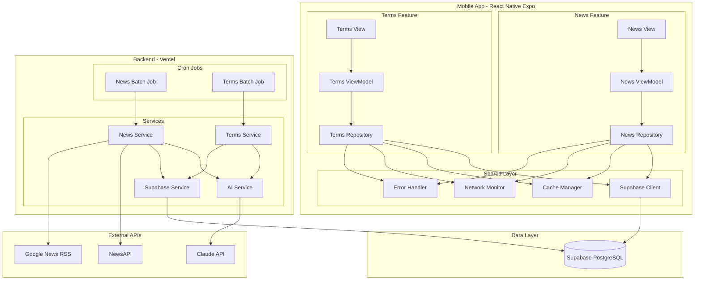
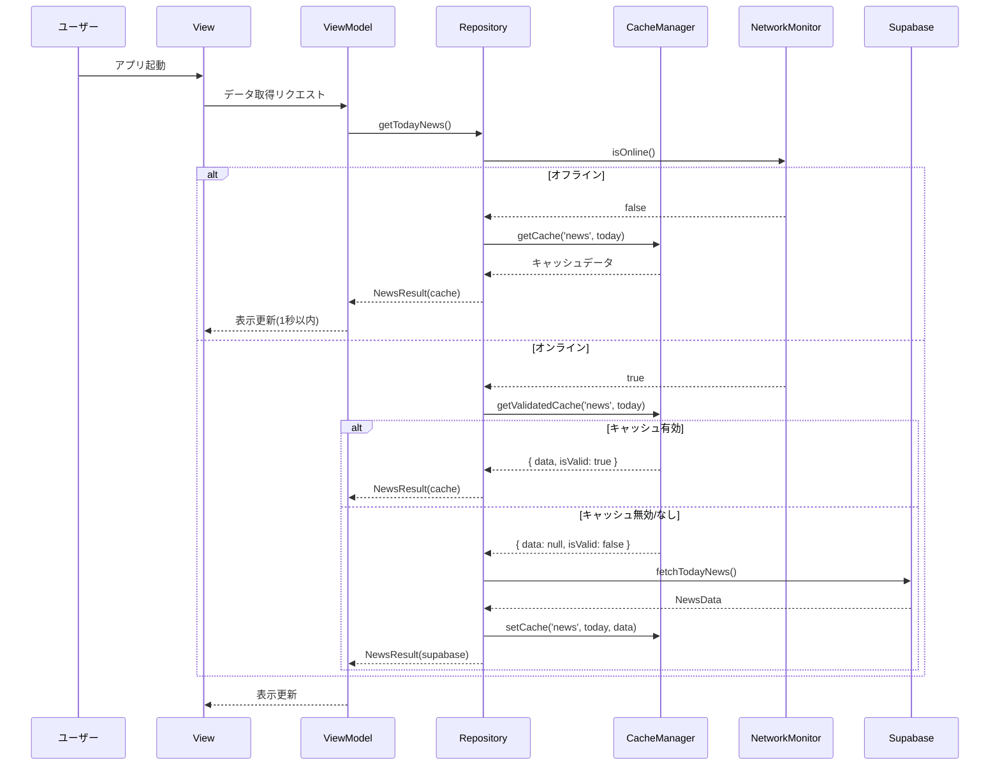

# Firebase → Supabase 移行設計書

## 1. 概要

本設計書は、Firebase FirestoreからSupabase PostgreSQLへの移行に関する技術設計を定義する。
MVVM + Repository パターンを維持し、Repository層以下のみを変更することで、ViewModel/Viewへの影響を最小化する。

---

## 2. アーキテクチャ

### 2.1 移行後のアーキテクチャ



### 2.2 変更範囲

| レイヤー           | 変更有無 | 説明                       |
| ------------------ | -------- | -------------------------- |
| View               | なし     | UI変更なし                 |
| ViewModel          | なし     | インターフェース維持       |
| Repository         | あり     | Supabaseクライアントに変更 |
| Supabase/Firestore | 全面刷新 | Firebase → Supabase        |
| Cache              | 拡張     | オフライン対応強化         |
| Error              | 更新     | Supabaseエラー型に対応     |

---

## 3. データベース設計

### 3.1 Supabase PostgreSQL スキーマ

#### news テーブル

```sql
CREATE TABLE news (
    date DATE PRIMARY KEY,
    world_news_title TEXT NOT NULL,
    world_news_summary TEXT NOT NULL,
    world_news_updated_at TIMESTAMPTZ NOT NULL,
    japan_news_title TEXT NOT NULL,
    japan_news_summary TEXT NOT NULL,
    japan_news_updated_at TIMESTAMPTZ NOT NULL,
    created_at TIMESTAMPTZ NOT NULL DEFAULT NOW(),
    updated_at TIMESTAMPTZ NOT NULL DEFAULT NOW()
);

-- 更新日時自動更新トリガー
CREATE OR REPLACE FUNCTION update_updated_at()
RETURNS TRIGGER AS $$
BEGIN
    NEW.updated_at = NOW();
    RETURN NEW;
END;
$$ LANGUAGE plpgsql;

CREATE TRIGGER news_updated_at
    BEFORE UPDATE ON news
    FOR EACH ROW
    EXECUTE FUNCTION update_updated_at();

-- インデックス
CREATE INDEX idx_news_date ON news(date DESC);
```

#### terms テーブル

```sql
CREATE TABLE terms (
    id SERIAL PRIMARY KEY,
    date DATE NOT NULL,
    name TEXT NOT NULL,
    description TEXT NOT NULL,
    difficulty TEXT NOT NULL CHECK (difficulty IN ('beginner', 'intermediate', 'advanced')),
    created_at TIMESTAMPTZ NOT NULL DEFAULT NOW()
);

-- 日付別インデックス
CREATE INDEX idx_terms_date ON terms(date DESC);

-- 1日3用語の制約(アプリケーションレベルで管理)
```

#### terms_history テーブル

```sql
CREATE TABLE terms_history (
    id SERIAL PRIMARY KEY,
    term_name TEXT NOT NULL,
    delivered_at TIMESTAMPTZ NOT NULL DEFAULT NOW(),
    difficulty TEXT NOT NULL CHECK (difficulty IN ('beginner', 'intermediate', 'advanced'))
);

-- 重複チェック用インデックス
CREATE INDEX idx_terms_history_name ON terms_history(term_name);
CREATE INDEX idx_terms_history_delivered_at ON terms_history(delivered_at DESC);
```

#### batch_metadata テーブル

```sql
CREATE TABLE batch_metadata (
    id INTEGER PRIMARY KEY DEFAULT 1,
    news_last_updated TIMESTAMPTZ NOT NULL DEFAULT NOW(),
    terms_last_updated TIMESTAMPTZ NOT NULL DEFAULT NOW(),
    CONSTRAINT single_row CHECK (id = 1)
);

-- 初期レコード挿入
INSERT INTO batch_metadata (id) VALUES (1);
```

### 3.2 Row Level Security (RLS) ポリシー

```sql
-- news テーブル
ALTER TABLE news ENABLE ROW LEVEL SECURITY;

CREATE POLICY "Allow public read" ON news
    FOR SELECT USING (true);

CREATE POLICY "Allow service role write" ON news
    FOR ALL USING (auth.role() = 'service_role');

-- terms テーブル
ALTER TABLE terms ENABLE ROW LEVEL SECURITY;

CREATE POLICY "Allow public read" ON terms
    FOR SELECT USING (true);

CREATE POLICY "Allow service role write" ON terms
    FOR ALL USING (auth.role() = 'service_role');

-- terms_history テーブル
ALTER TABLE terms_history ENABLE ROW LEVEL SECURITY;

CREATE POLICY "Allow service role only" ON terms_history
    FOR ALL USING (auth.role() = 'service_role');

-- batch_metadata テーブル
ALTER TABLE batch_metadata ENABLE ROW LEVEL SECURITY;

CREATE POLICY "Allow public read" ON batch_metadata
    FOR SELECT USING (true);

CREATE POLICY "Allow service role write" ON batch_metadata
    FOR ALL USING (auth.role() = 'service_role');
```

### 3.3 データマッピング

| Firestore            | PostgreSQL            | 変換                            |
| -------------------- | --------------------- | ------------------------------- |
| news/{date}          | news.date             | ドキュメントID → DATE型         |
| worldNews.title      | world_news_title      | ネスト解除                      |
| worldNews.summary    | world_news_summary    | ネスト解除                      |
| worldNews.updatedAt  | world_news_updated_at | Timestamp → TIMESTAMPTZ         |
| terms/{date}/terms[] | terms (複数行)        | 配列 → 複数レコード             |
| metadata/batch       | batch_metadata        | 単一ドキュメント → 単一レコード |

---

## 4. コンポーネント設計

### 4.1 バックエンド

#### backend/src/config/supabase.ts

```typescript
/**
 * Supabase クライアント初期化
 * サービスロールキーを使用してサーバーサイド認証
 */
import { createClient, SupabaseClient } from '@supabase/supabase-js';
import { Database } from '../types/database.types';

let supabaseClient: SupabaseClient<Database> | undefined;

export function initializeSupabase(): SupabaseClient<Database> {
  if (supabaseClient) {
    return supabaseClient;
  }

  const supabaseUrl = process.env.SUPABASE_URL;
  const supabaseServiceRoleKey = process.env.SUPABASE_SERVICE_ROLE_KEY;

  if (!supabaseUrl || !supabaseServiceRoleKey) {
    throw new Error('Supabase環境変数が不足しています: SUPABASE_URL, SUPABASE_SERVICE_ROLE_KEY');
  }

  supabaseClient = createClient<Database>(supabaseUrl, supabaseServiceRoleKey, {
    auth: {
      autoRefreshToken: false,
      persistSession: false,
    },
  });

  return supabaseClient;
}

export function getSupabase(): SupabaseClient<Database> {
  if (!supabaseClient) {
    return initializeSupabase();
  }
  return supabaseClient;
}
```

#### backend/src/models/news.model.ts(更新)

```typescript
/**
 * News Data Model (Supabase版)
 */

export interface NewsRow {
  date: string; // YYYY-MM-DD
  world_news_title: string;
  world_news_summary: string;
  world_news_updated_at: string; // ISO 8601
  japan_news_title: string;
  japan_news_summary: string;
  japan_news_updated_at: string; // ISO 8601
  created_at: string;
  updated_at: string;
}

export interface NewsInsert {
  date: string;
  world_news_title: string;
  world_news_summary: string;
  world_news_updated_at: string;
  japan_news_title: string;
  japan_news_summary: string;
  japan_news_updated_at: string;
}

// バリデーション関数は既存ロジックを維持
export function validateNewsSummary(summary: string, type: 'world' | 'japan'): void {
  const length = summary.length;
  if (length < 1800 || length > 2200) {
    throw new Error(
      `${type === 'world' ? '世界' : '日本'}ニュースの要約文は1800〜2200文字である必要があります(現在: ${length}文字)`
    );
  }
}
```

### 4.2 フロントエンド

#### mobile/src/supabase/client.ts

```typescript
/**
 * Supabase クライアント (React Native)
 * anon keyを使用してクライアントサイド認証
 */
import 'react-native-url-polyfill/auto';
import AsyncStorage from '@react-native-async-storage/async-storage';
import { createClient, SupabaseClient } from '@supabase/supabase-js';
import { Database } from '../types/database.types';

const SUPABASE_URL = process.env.EXPO_PUBLIC_SUPABASE_URL!;
const SUPABASE_ANON_KEY = process.env.EXPO_PUBLIC_SUPABASE_ANON_KEY!;

export const supabase: SupabaseClient<Database> = createClient<Database>(
  SUPABASE_URL,
  SUPABASE_ANON_KEY,
  {
    auth: {
      storage: AsyncStorage,
      autoRefreshToken: true,
      persistSession: true,
      detectSessionInUrl: false,
    },
  }
);

export function getSupabase(): SupabaseClient<Database> {
  return supabase;
}
```

#### mobile/src/supabase/queries.ts

```typescript
/**
 * Supabase クエリ
 * Firestoreクエリと同等の機能を提供
 */
import { supabase } from './client';
import { NewsData, TermsData, BatchMetadata } from './types';
import { toSupabaseError, logSupabaseError } from './errors';

const JST_OFFSET = 9 * 60 * 60 * 1000;

export function formatDateToJST(date: Date): string {
  const jstDate = new Date(date.getTime() + JST_OFFSET);
  return jstDate.toISOString().split('T')[0];
}

export async function fetchTodayNews(): Promise<{ data: NewsData | null; exists: boolean }> {
  const today = formatDateToJST(new Date());

  try {
    const { data, error } = await supabase.from('news').select('*').eq('date', today).single();

    if (error) {
      if (error.code === 'PGRST116') {
        // No rows returned
        return { data: null, exists: false };
      }
      throw error;
    }

    const newsData: NewsData = {
      date: data.date,
      worldNews: {
        title: data.world_news_title,
        summary: data.world_news_summary,
        updatedAt: data.world_news_updated_at,
      },
      japanNews: {
        title: data.japan_news_title,
        summary: data.japan_news_summary,
        updatedAt: data.japan_news_updated_at,
      },
      createdAt: data.created_at,
      updatedAt: data.updated_at,
    };

    return { data: newsData, exists: true };
  } catch (error) {
    const supabaseError = toSupabaseError(error);
    logSupabaseError(supabaseError, 'fetchTodayNews');
    throw supabaseError;
  }
}

export async function fetchTodayTerms(): Promise<{ data: TermsData | null; exists: boolean }> {
  const today = formatDateToJST(new Date());

  try {
    const { data, error } = await supabase
      .from('terms')
      .select('*')
      .eq('date', today)
      .order('id', { ascending: true });

    if (error) throw error;

    if (!data || data.length === 0) {
      return { data: null, exists: false };
    }

    const termsData: TermsData = {
      date: today,
      terms: data.map((row) => ({
        name: row.name,
        description: row.description,
        difficulty: row.difficulty as 'beginner' | 'intermediate' | 'advanced',
      })),
      createdAt: data[0].created_at,
      updatedAt: data[0].created_at,
    };

    return { data: termsData, exists: true };
  } catch (error) {
    const supabaseError = toSupabaseError(error);
    logSupabaseError(supabaseError, 'fetchTodayTerms');
    throw supabaseError;
  }
}

export async function fetchBatchMetadata(): Promise<BatchMetadata | null> {
  try {
    const { data, error } = await supabase.from('batch_metadata').select('*').eq('id', 1).single();

    if (error) {
      console.warn('[Supabase] Failed to fetch batch metadata:', error);
      return null;
    }

    return {
      newsLastUpdated: new Date(data.news_last_updated).getTime(),
      termsLastUpdated: new Date(data.terms_last_updated).getTime(),
    };
  } catch (error) {
    console.warn('[Supabase] Failed to fetch batch metadata:', error);
    return null;
  }
}
```

#### mobile/src/supabase/errors.ts

```typescript
/**
 * Supabase エラーハンドリング
 * Firestoreエラーと同等のインターフェースを提供
 */

export type SupabaseErrorCode =
  | 'network-error'
  | 'permission-denied'
  | 'not-found'
  | 'timeout'
  | 'unknown';

export class SupabaseError extends Error {
  code: SupabaseErrorCode;
  retryable: boolean;

  constructor(code: SupabaseErrorCode, message: string, retryable: boolean) {
    super(message);
    this.name = 'SupabaseError';
    this.code = code;
    this.retryable = retryable;
  }
}

export function toSupabaseError(error: unknown): SupabaseError {
  if (error instanceof SupabaseError) {
    return error;
  }

  // PostgrestError handling
  if (typeof error === 'object' && error !== null && 'code' in error) {
    const pgError = error as { code: string; message: string };

    switch (pgError.code) {
      case 'PGRST301':
        return new SupabaseError('network-error', 'ネットワークエラーが発生しました', true);
      case '42501':
        return new SupabaseError('permission-denied', 'アクセス権限がありません', false);
      case 'PGRST116':
        return new SupabaseError('not-found', 'データが見つかりません', false);
      default:
        return new SupabaseError('unknown', pgError.message || '不明なエラーが発生しました', true);
    }
  }

  return new SupabaseError('unknown', '不明なエラーが発生しました', true);
}

export function logSupabaseError(error: SupabaseError, context: string): void {
  console.error(`[Supabase Error] ${context}:`, {
    code: error.code,
    message: error.message,
    retryable: error.retryable,
  });
}
```

---

## 5. オフライン対応設計

### 5.1 オフライン戦略



### 5.2 NetworkMonitor 実装

```typescript
/**
 * ネットワーク状態監視
 */
import NetInfo, { NetInfoState } from '@react-native-community/netinfo';

class NetworkMonitor {
  private isConnected: boolean = true;
  private listeners: Set<(isOnline: boolean) => void> = new Set();

  constructor() {
    NetInfo.addEventListener(this.handleNetworkChange.bind(this));
  }

  private handleNetworkChange(state: NetInfoState): void {
    const wasConnected = this.isConnected;
    this.isConnected = state.isConnected ?? false;

    if (wasConnected !== this.isConnected) {
      this.listeners.forEach((listener) => listener(this.isConnected));
    }
  }

  isOnline(): boolean {
    return this.isConnected;
  }

  subscribe(listener: (isOnline: boolean) => void): () => void {
    this.listeners.add(listener);
    return () => this.listeners.delete(listener);
  }
}

export const networkMonitor = new NetworkMonitor();
```

### 5.3 Repository でのオフライン対応

```typescript
async getTodayNews(): Promise<NewsResult> {
  const today = formatDateToJST(new Date());

  // オフライン時はキャッシュを即座に返す
  if (!networkMonitor.isOnline()) {
    const cacheEntry = await this.cacheManager.getCacheEntry<NewsData>('news', today);
    if (cacheEntry) {
      return { success: true, data: cacheEntry.data, source: 'cache' };
    }
    return {
      success: false,
      data: null,
      source: 'cache',
      error: { code: 'network-error', message: 'オフラインです', retryable: true },
    };
  }

  // オンライン時は既存ロジック(メタデータチェック付き)
  // ...
}
```

---

## 6. 移行手順

### Phase 1: 準備(1-2日)

1. Supabaseプロジェクト作成
2. データベーススキーマ作成(SQL実行)
3. RLSポリシー設定
4. 環境変数設定

### Phase 2: バックエンド移行(2-3日)

1. `@supabase/supabase-js`インストール
2. `backend/src/config/supabase.ts`作成
3. データモデル更新
4. バッチサービス更新
5. ユニットテスト更新
6. ローカル動作確認

### Phase 3: フロントエンド移行(2-3日)

1. `@supabase/supabase-js`インストール
2. `mobile/src/supabase/`ディレクトリ作成
3. クライアント・クエリ・エラー実装
4. Repository更新
5. NetworkMonitor実装
6. ユニットテスト更新

### Phase 4: Firebase削除(1日)

1. Firebaseパッケージアンインストール
2. Firebase関連コード削除
3. 設定ファイル削除
4. ビルド確認

### Phase 5: データ移行(1日)

1. Firestoreデータエクスポート
2. データ変換スクリプト実行
3. Supabaseへインポート
4. 整合性検証

### Phase 6: テスト・検証(2-3日)

1. 統合テスト
2. E2Eテスト
3. オフラインテスト
4. パフォーマンステスト
5. 本番デプロイ

---

## 7. ディレクトリ構造(移行後)

### backend/src/

```
├── config/
│   └── supabase.ts          # 新規(firebase.ts削除)
├── models/
│   ├── news.model.ts        # 更新
│   ├── terms.model.ts       # 更新
│   └── metadata.model.ts    # 更新
├── types/
│   └── database.types.ts    # 新規(Supabase型定義)
└── services/
    ├── supabase/            # 新規
    │   ├── news-service.ts
    │   ├── terms-service.ts
    │   └── metadata-service.ts
    └── ...
```

### mobile/src/

```
├── supabase/                # 新規(firestore/削除)
│   ├── client.ts
│   ├── queries.ts
│   ├── errors.ts
│   └── types.ts
├── network/                 # 新規
│   └── network-monitor.ts
├── cache/
│   ├── cache-manager.ts     # 更新
│   └── types.ts
└── ...
```

---

## 8. リスクと軽減策

| リスク                   | 影響 | 軽減策                                            |
| ------------------------ | ---- | ------------------------------------------------- |
| データ移行時のデータ損失 | 高   | 移行前にFirestoreバックアップ、検証スクリプト作成 |
| オフライン機能の劣化     | 中   | 既存CacheManagerを拡張、十分なテスト              |
| Supabase無料枠超過       | 中   | 使用量監視、必要に応じて有料プラン検討            |
| 移行中のサービス停止     | 中   | 段階的移行、フィーチャーフラグ活用                |
| パフォーマンス劣化       | 低   | インデックス最適化、クエリチューニング            |

---

## 9. 要件トレーサビリティ

| 移行要件 | 設計セクション | 主要コンポーネント                      |
| -------- | -------------- | --------------------------------------- |
| M1       | 3.2, 6         | Supabaseプロジェクト設定                |
| M2       | 3.1            | PostgreSQLスキーマ                      |
| M3       | 4.1            | backend/src/config/supabase.ts          |
| M4       | 4.1            | backend/src/models/\*                   |
| M5       | 4.1            | services/supabase/news-service.ts       |
| M6       | 4.1            | services/supabase/terms-service.ts      |
| M7       | 4.2            | mobile/src/supabase/client.ts           |
| M8       | 4.2            | mobile/src/supabase/queries.ts          |
| M9       | 4.2            | news-repository.ts, terms-repository.ts |
| M10      | 5              | CacheManager, NetworkMonitor            |
| M11      | 6 Phase 4      | パッケージ削除                          |
| M12      | 6 Phase 5      | データ移行スクリプト                    |
| M13      | 6 Phase 1      | 環境変数設定                            |
| M14      | 6 Phase 6      | テスト・検証                            |
